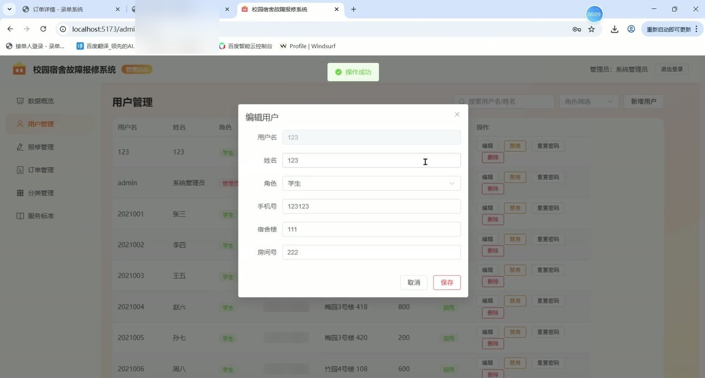
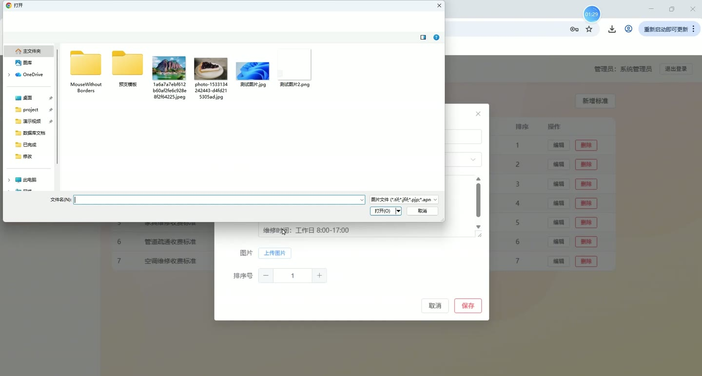
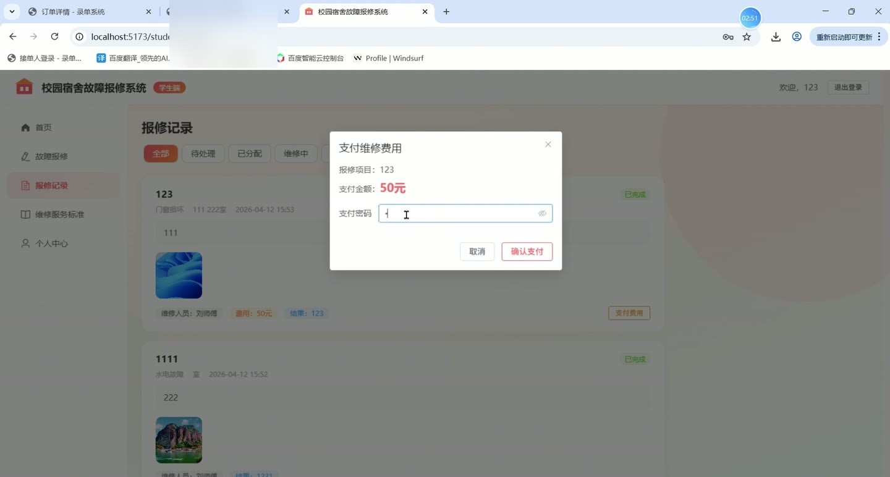
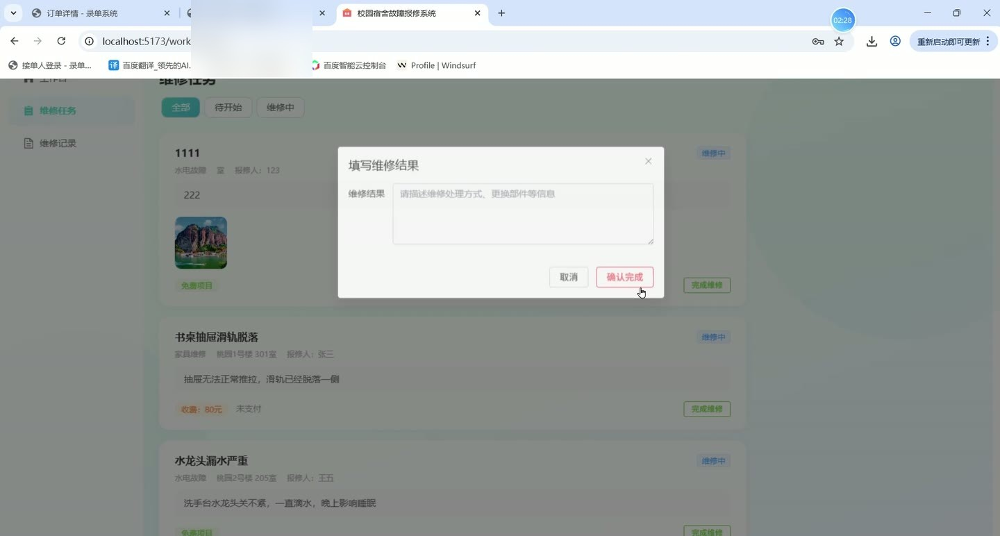
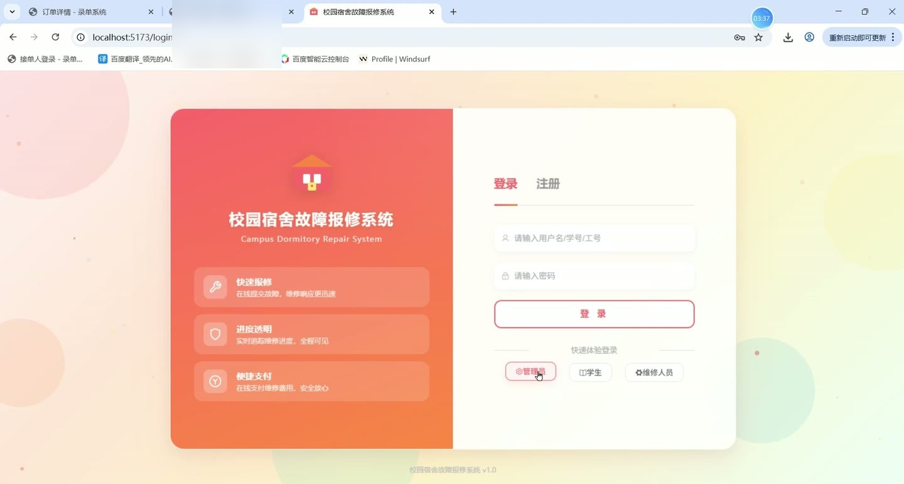

# (附文档)Springboot3+Vue3+MySQL 校园宿舍故障报修系统

**技术栈**：Springboot3、Vue3、MySQL

### 系统简介

校园宿舍故障报修系统采用前后端分离架构（Springboot3 + Vue3），支持学生、维修人员、管理员三种角色协同工作。学生可在线提交报修请求并支付费用，维修人员接收分配任务并完成维修，管理员集中管理用户、报修单、分类、服务标准及订单费用。
 
### 核心功能
 
### 普通用户端

 
- 登录/注册：输入用户名和密码登录系统，或注册新账号（选择学生或维修人员角色）。 
- 快速体验登录：一键点击管理员/学生/维修人员预设账号快速进入对应后台。 
- 查看个人首页：显示欢迎信息及系统简介。 
- 提交报修请求：选择故障分类（如照明、网络、门窗等），填写标题、描述，可上传多张故障图片。 
- 查看我的报修记录：按状态筛选（待处理/已分配/维修中/已完成），列表展示每条的标题、分类、状态、宿舍信息。 
- 查看报修详情：点击单条记录查看完整信息，包括故障描述、图片、维修人员、费用及支付状态。 
- 在线支付：对收费报修单输入支付密码完成支付，系统自动扣减余额并更新支付状态。 
- 查看服务标准：浏览维修分类对应的服务标准列表，包括标准标题、内容、图片及排序。 
- 个人资料管理：修改真实姓名、手机号、宿舍楼栋与房间号。 
- 修改登录密码：输入原密码与新密码完成密码更新。 
- 设置支付密码：首次使用支付功能时设置支付密码。 
- 账户充值：输入金额为账户余额充值。
 
### 管理员端

 
- 数据概览：查看用户总数、报修总数、待处理数、维修中数、已完成数、待支付数等统计卡片。 
- 查看最新报修申请：首页显示最近6条报修记录，含学生姓名、宿舍、状态。 
- 用户管理：分页查询所有用户（支持按角色和关键字搜索），查看用户名、真实姓名、角色、状态。 
- 新增用户：填写用户名、真实姓名、角色、手机号等信息添加用户。 
- 编辑用户：修改用户基本信息（不含密码）。 
- 删除用户：移除指定账号。 
- 启用/禁用用户：切换用户账号状态（禁用后无法登录）。 
- 重置用户密码：将指定用户密码重置为 123456。 
- 报修管理：分页查看全部报修单，支持按标题关键词和状态筛选。 
- 分配维修人员：对待处理的报修单选择维修人员并确认分配。 
- 查看报修详情：弹窗展示完整报修信息，包括故障描述、图片、维修结果、费用及支付状态。 
- 订单管理：查看所有维修订单列表，支持按报修状态和支付状态筛选。 
- 分类管理：维护维修分类（名称、描述、图标标识、是否收费、收费金额、启用/禁用状态）。 
- 新增/编辑/删除分类：填写分类信息并保存，支持删除已有分类。 
- 服务标准管理：维护各分类下的服务标准（标题、内容、图片、排序号）。 
- 新增/编辑/删除服务标准：填写标准信息并保存，支持删除。
 
### 维修人员端

 
- 查看个人首页：显示欢迎信息及个人待处理任务数量等概览。 
- 查看我的任务：分页显示分配给自己的报修单，支持按状态筛选。 
- 开始维修：将任务状态从“已分配”变更为“维修中”。 
- 完成维修：填写维修结果，将任务状态变更为“已完成”，记录完成时间。 
- 查看个人维修记录：分页查看自己处理过的所有报修单。
 
### 技术栈

 后端框架Springboot 3.2 ORMMyBatis-Plus 3.5 权限认证JWT（jjwt 0.12） 前端框架Vue 3 + Element Plus 状态管理Vue Router 4（路由守卫控制访问） 构建工具Vite 5 数据库MySQL 8.0 文件上传Spring MultipartFile
 
### 交付内容

 
- 后端完整源码 
- 前端完整源码 
- 数据库初始化脚本 
- 万字文档

## 界面展示

---

## 获取完整源码 + 万字文档

本仓库为项目介绍页。**完整前后端源码、数据库初始化脚本、万字项目文档**，请加微信 `kangkangcode`，或访问 [codekk.top](http://codekk.top) 获取。

可作课程设计 / 毕业设计参考，支持远程部署调试。